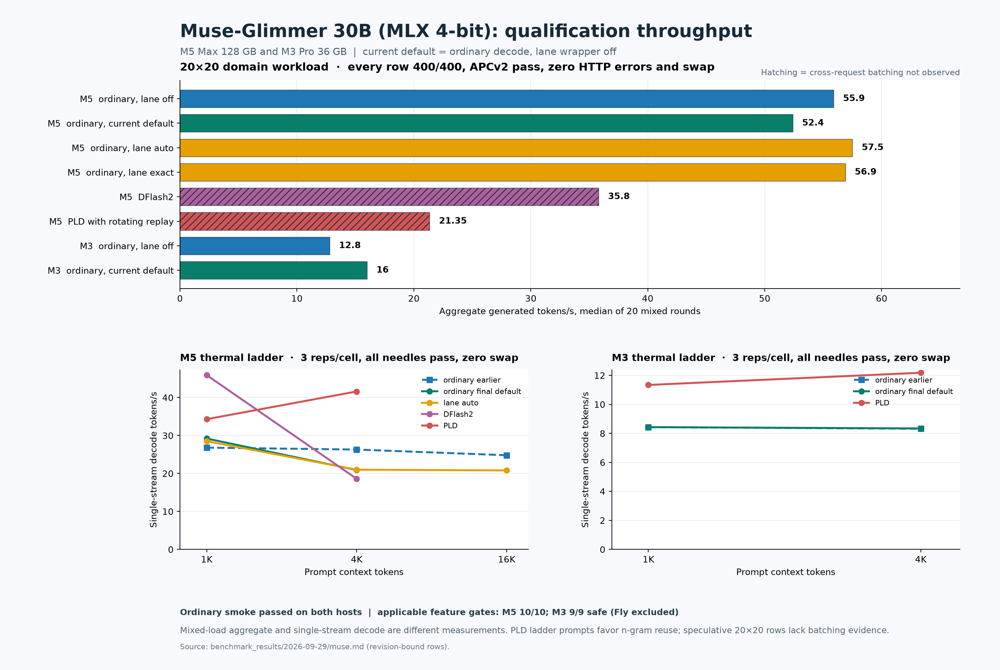

# Muse-Glimmer 30B, MLX 4-bit

Artifact: `Muse-Glimmer-30B-mlx-4bit`; config SHA-256 `c7f48468db2ef9c3de4cb912be24ecc9fbed36d83f3b8386a0b224ee7ba876ca`. These are source-bound results from the M5 Max 128 GB and M3 Pro 36 GB. Rates from the 20×20 mixed domain workload are aggregate generated tokens/s; ladder decode rates are per stream. The latter used three thermally admitted measured repetitions per cell, a warmup, needle recall, and zero-swap checks.

[Vector chart](muse-performance.svg) · [Chart source](make_muse_chart.py)

## Selection and scope

The selected general route is **ordinary decode**. For this q4 artifact, `--lane-matmul auto` resolves to **off**; an explicit lane policy still permits experiments on the M5. Other Muse weight formats retain their detected crossover pending separate qualification. DFlash2 and prompt lookup (PLD) remain explicit routes. The full TensorFold fused Qwen3.8 target executor has no Muse implementation; the applicable TensorFold-derived lane projection kernel was tested separately. Muse has no native MTP. No observation here establishes production use.

The final-source ordinary status at `45a91d2b` reports lane mode `off`, no installed wrapper, and the `muse-full-sliding-cache-geometry-v1` admission budget on both hosts.

The formal earlier served smoke passed on both hosts with the expected ordinary route and sane output. Current-source feature groups also passed short-chat, streaming, and repeated-prefix base checks. The earlier M5 1K–65K context ladder had nine passing measured cells before the user paused its 131K cell; that interruption was not a model failure.

## 20×20 batching and APCv2

| Host and route | Source | Graded | HTTP errors | Median aggregate tok/s | APCv2 prefix reuse | Cross-request batching | Swap-out pages |
|---|---|---:|---:|---:|---|---|---:|
| M5 ordinary, lane off | `452392ea` | 400/400 | 0 | 55.9 | passed | observed | 0 |
| M5 ordinary, current default | `45a91d2b` | 400/400 | 0 | 52.4 | passed | observed | 0 |
| M5 ordinary, lane auto | `452392ea` | 400/400 | 0 | 57.5 | passed | observed | 0 |
| M5 ordinary, lane exact | `452392ea` | 400/400 | 0 | 56.9 | passed | observed | 0 |
| M5 DFlash2 | `176eeaea` | 400/400 | 0 | 35.8 | passed | not observed | 0 |
| M5 PLD with rotating replay | `710a3473` | 400/400 | 0 | 21.35 | passed | not observed | 0 |
| M3 ordinary, lane off | `13358154` | 400/400 | 0 | 12.8 | passed | observed | 0 |
| M3 ordinary, current default | `45a91d2b` | 400/400 | 0 | 16.0 | passed | observed (peak 12) | 0 |

DFlash2 and PLD completed all 400 domain requests correctly, but their speculative executors did not expose cross-request batching in the gate. Their 20×20 runs therefore failed the combined batching gate even though quality, HTTP stability, and APCv2 prefix reuse passed. DFlash2 proposal acceptance and target verification width do not by themselves prove cross-request batching. PLD's rotating replay engaged for 611 rounds, but `pld_batched_rounds` remained zero.

## Thermally controlled single-prompt performance

| Host and route | Source | Prompt tokens | Median cold TTFT (s) | Median decode tok/s | Needle checks | Swap-out pages |
|---|---|---:|---:|---:|---:|---:|
| M5 ordinary, lane off | `13358154` | 1,024 | 1.67 | 26.8 | 6/6 | 0 |
| M5 ordinary, lane off | `13358154` | 4,096 | 6.52 | 26.3 | 6/6 | 0 |
| M5 ordinary, lane off | `13358154` | 16,384 | 26.76 | 24.8 | 6/6 | 0 |
| M5 ordinary, current default | `45a91d2b` | 1,024 | 1.22 | 29.2 | 6/6 | 0 |
| M5 ordinary, current default | `45a91d2b` | 4,096 | 7.81 | 20.9 | 6/6 | 0 |
| M5 ordinary, lane auto | `13358154` | 1,024 | 1.21 | 28.5 | 6/6 | 0 |
| M5 ordinary, lane auto | `13358154` | 4,096 | 8.55 | 21.0 | 6/6 | 0 |
| M5 ordinary, lane auto | `13358154` | 16,384 | 32.09 | 20.8 | 6/6 | 0 |
| M5 DFlash2 | `176eeaea` | 1,024 | 1.30 | 45.9 | 6/6 | 0 |
| M5 DFlash2 | `176eeaea` | 4,096 | 10.52 | 18.6 | 6/6 | 0 |
| M5 PLD | `95aef357` | 1,024 | 1.55 | 34.3 | 6/6 | 0 |
| M5 PLD | `95aef357` | 4,096 | 6.21 | 41.6 | 6/6 | 0 |
| M3 ordinary, lane off | `176eeaea` | 1,024 | 10.04 | 8.43 | 6/6 | 0 |
| M3 ordinary, lane off | `176eeaea` | 4,096 | 40.91 | 8.32 | 6/6 | 0 |
| M3 ordinary, current default | `45a91d2b` | 1,024 | 10.05 | 8.43 | 6/6 | 0 |
| M3 ordinary, current default | `45a91d2b` | 4,096 | 40.93 | 8.34 | 6/6 | 0 |
| M3 PLD | `95aef357` | 1,024 | 9.89 | 11.34 | 6/6 | 0 |
| M3 PLD | `95aef357` | 4,096 | 40.81 | 12.18 | 6/6 | 0 |

The M5 lane-auto run installed grouped wrappers around 417 q4 projections. It slightly improved the 20×20 median, but lost 20–21% decode speed at 4K/16K, increased TTFT, and raised the ready process footprint from about 17.1 to 25.1 GiB. At width one the lane kernel itself recorded no calls; the wrappers fell back to stock math, so these losses are wrapper and grouping costs. A no-group candidate restored the footprint but still lost at longer contexts. The M3 cannot execute this M5-only lane kernel; the loader now skips installation and preserves stock weights.

DFlash2's 1K speed gain did not carry to 4K or the mixed 20×20 workload. PLD's ladder prompts contain repeated filler that can trigger n-gram reuse; these figures are not a general-chat speed prediction. Its diverse 20×20 rate was 21.35 tokens/s versus ordinary's 55.9, with no observed cross-request batching. Both speculative routes remain opt-in.

The final-source M5 4K default cell varied across its three repetitions: 20.7–29.3 decode tokens/s and 4.23–7.96 seconds cold TTFT. Thermal state remained zero with stable admission temperatures and no swap in every repetition. The 20.9 tokens/s median is the conservative result; this spread limits small speed comparisons against earlier source revisions.

## Feature qualification

| Feature | M5 | M3 | Evidence and limit |
|---|---|---|---|
| APCv2 rolling checkpoints | qualified | qualified | Muse cache projection admits hybrid rolling boundaries. M5 default-cadence isolated run planned 39, published 28, and resumed with 1,536 cached tokens; its final combined sweep also passed (12 planned, 10 published, 1,536 cached). M3 256-token-slice run planned 13, published 10, and resumed with 1,024. Both hosts observed a rolling hit and zero swap. |
| Cache capsules and block persistence | qualified | qualified | Capacity reservation and disk restore engaged in served feature groups. |
| SRPT prefill scheduling, memory preemption, host memory signals | qualified | qualified | Each gate engaged and passed. |
| PLD rotating replay | qualified | qualified | Mechanism engaged in a focused feature group; production route remains opt-in. |
| Spomin live compaction | qualified | qualified | Approximate operation engaged under its explicit policy; ordinary decode remains exact. |
| Multi-LoRA | qualified | qualified | Mixed served forwards and 3,744 delta applications passed after Muse key resolution. |
| Fly verification route gate | qualified on M5 | open on M3 | Neutral greedy and sampled calls selected Fly, while penalty-controlled calls selected exact verification. No relaxed accepts were observed, so the approximate acceptance path is not qualified. M3 DFlash2 loading caused 87,176 swap-out pages in the earlier combined attempt, and its repeated-prefix probe returned 429. |
| Junction snapshots, int8 prefill, native self-MTP copy draft, bit-exact verify | not applicable | not applicable | Muse's declared route/cache or model topology does not support these gates. |

The final-source M5 combined sweep at `45a91d2b` passed **10/10** applicable gates with zero swap, including rolling recovery. The M3 safe combined sweep at `95aef357` passed **9/9** applicable gates, including rolling, with zero swap; Fly was excluded because its external-draft route has a separate unresolved load/admission gate. These are per-operation qualification receipts, not a claim that every combination has been selected or used in production.

## Issues repaired and open gates

- Muse LoRA checkpoint keys used `language_model.model.*`, while the loaded text model used `model.*`. Single and multi-LoRA loading now resolve and validate the module keys, with rollback on failure.
- The M3 previously installed M5-only lane wrappers that could only fall back to stock math. Device gating now skips them before changing weights.
- A quiet streaming prefill was not checked for client disconnect after its first event. The handler now notices the disconnect. Muse lacked the cache projection required by hybrid rolling-checkpoint admission, so every planned checkpoint had been degraded. The projection and a progress-triggered qualification probe exposed and repaired that gate.
- The Muse cache projection uses the declared attention geometry and a conservative provisional forward-transient bound. Final-source ordinary/default 20×20 loads on both hosts passed 400/400 with APCv2 reuse, cross-request batching, and zero swap.
- The M3 DFlash2 route is not qualified because its prior load caused swap and a 429 gate failure. M5 DFlash2 remains opt-in because of slower 4K and mixed-load performance and missing cross-request batching evidence.

## Receipt integrity

These SHA-256 digests identify the private source-bound receipts used for the final-source rows. The receipts include raw request and local execution detail, so the public page publishes their checksums and results rather than their contents.

| Host | Receipt | SHA-256 |
|---|---|---|
| M5 | current-default 20×20 | `790480c9b5b90825cf259da946029dd8bbb6f107ea7a26fbbebe3d0d7bffb37d` |
| M5 | current-default 1K/4K ladder run | `ebee138e78cf4b31c0c6614953af7c70016e722e5fc7a0e26c63712f7ef38660` |
| M5 | final-default feature sweep | `f11e24c07e57827a6db3f8e459bcef1283cdde717321e621c6afab5a2d75e8aa` |
| M3 | current-default 20×20 | `0b32502de4cea1fa4bd6924d9948305c1c56655c4f4738e8ca1ca43ac66c3ef8` |
| M3 | current-default 1K/4K ladder run | `5c114676d91e800b7274b7fff760ef1c2c9d3fdd2bb8a68a446e142c11552c32` |
| M3 | current-default safe feature sweep | `9c233ed3d2d7cd8707bafedea9a3ec7a71dcebbb0a26b39619dcfe25a46777d1` |

The public [script snapshot](scripts/manifest.json) includes the smoke, stress, thermal-ladder and feature harnesses plus candidate policies, with source and published SHA-256 digests. Model weights, LoRA payloads, raw prompts, local paths, and credentials are excluded.
