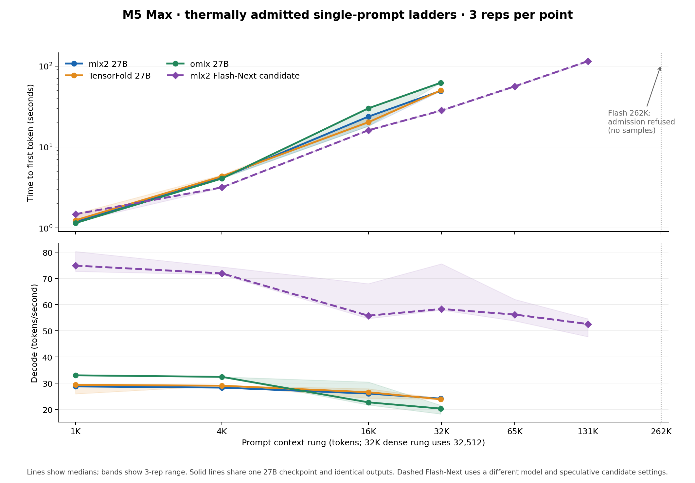

# Current-main comparison: mlx2, TensorFold, and omlx

This analysis pins the three source revisions and distinguishes exact-checkpoint Flash-Next compatibility from a shared-model speed control. Measurements use the M5 Max with 128 GB. The M3 Pro cannot load the staged Flash-Next artifact.

| Engine | Pinned main revision | Flash-Next checkpoint used for mlx2 ladder |
|---|---|---|
| mlx2 | `3e179cff9aee547dcddf8b734c286b12e75cc563` | Supported; candidate performance in [flash-next.md](flash-next.md) |
| TensorFold | `6b2e4c40064b1e4a05965f61b19ce87b5e0265b3` | Loader preflight rejects this group-64 checkpoint; Flash kernels require group-32 |
| omlx | `d6b2b92b11ebcbf4a4c1f002b0d590a3117212a8` | Load fails on this text-only checkpoint; details below |

The shared Flash checkpoint is `Qwen3.8-Flash-Next-MLX-4bit-MTP`, config SHA-256 `2fe9ba742da993ffe27c68f56ddc30deff43ed5aeb07d25a82cc6381d9208d9b`. TensorFold main's `info` command identified `qwen4_exp` and rejected 4-bit/group-64 before reading weights because its fused Flash kernels require group-32. The checkpoint named in its recipe has a different quantization layout. No TensorFold Flash speed number is presented as a same-checkpoint comparison.

omlx main first classified the checkpoint as a text `llm`; its text loader reported `Model type qwen4_exp not supported`. With an isolated per-model `vlm` override, its Qwen4 compatibility patch selected PLE mmap and native MTP, then the VLM loader failed because the text-only config has no `vision_config` (`NoneType` at `VisionModel`). The text fallback returned the same unsupported model-type error. Both attempts ended before benchmark samples; neither increased swapouts. This is a current-main load compatibility finding, not a speed result.

## Shared Qwen3.8 27B control

The three engines also run the same staged `Qwen3.8-27B-MLX-4bit` artifact (4-bit/group-64), with no external drafter. This is a separate model from Flash-Next. The common [comparison runner](compare_upstream_main.py) uses deterministic, identical prompts for each engine and repetition; calibrates rendered prompts to 1K, 4K, 16K, and 32K with the checkpoint tokenizer (the 32K rung reserves 256 tokens of output headroom); requests temperature-zero responses capped at 128 tokens without `min_tokens`; and admits three repetitions per context under the same thermal policy. It records client-observed time to first token and decode rate, completion length, needle correctness, swapouts, prompt hash, config hash, source head, and harness hash. Each engine runs alone under both GPU locks.

All twelve samples per engine passed: correct needle, 128 generated tokens, completed stream, thermal admission, and zero swap-out growth. Every paired prompt hash and full response hash matched across all three engines for the same cell and repetition. The chart includes the separate Flash-Next ladder for context, with its different checkpoint and candidate settings clearly distinguished.

| Prompt rung | Engine | Median time to first token | Median prefill | Median decode | First-token range across reps |
|---:|---|---:|---:|---:|---:|
| 1K | mlx2 | 1.20 s | 854 tok/s | 28.8 tok/s | 1.19–1.21 s |
| 1K | TensorFold | 1.25 s | 823 tok/s | 29.4 tok/s | 1.24–1.50 s |
| 1K | omlx | 1.15 s | 892 tok/s | 33.0 tok/s | 1.14–1.21 s |
| 4K | mlx2 | 4.16 s | 984 tok/s | 28.3 tok/s | 4.14–4.16 s |
| 4K | TensorFold | 4.35 s | 941 tok/s | 29.0 tok/s | 4.34–4.52 s |
| 4K | omlx | 4.08 s | 1,004 tok/s | 32.4 tok/s | 4.08–4.18 s |
| 16K | mlx2 | 23.74 s | 690 tok/s | 26.0 tok/s | 18.17–24.04 s |
| 16K | TensorFold | 20.26 s | 809 tok/s | 26.6 tok/s | 19.76–23.92 s |
| 16K | omlx | 30.09 s | 545 tok/s | 22.7 tok/s | 18.12–30.56 s |
| 32K¹ | mlx2 | 49.41 s | 658 tok/s | 24.1 tok/s | 49.16–49.50 s |
| 32K¹ | TensorFold | 50.10 s | 649 tok/s | 23.8 tok/s | 49.52–50.81 s |
| 32K¹ | omlx | 62.20 s | 523 tok/s | 20.3 tok/s | 62.19–63.89 s |

¹ The 32K rung calibrates to 32,512 prompt tokens, leaving 256 tokens of answer headroom in the 32,768-token context. Each cell has three measured repetitions. Prefill is the client-observed prompt-token count divided by first-token time, so it includes server and streaming overhead.

On this shared 27B control, omlx's decode median leads at 1K and 4K (about 15% over mlx2), while mlx2 leads omlx by about 15–19% at 16K and 32K. TensorFold and mlx2 are close on decode across the ladder; TensorFold has the lower 16K median first-token time, with substantial within-cell spread in both. omlx's 16K first-token times are especially variable (18.12, 30.56, 30.09 seconds); neither thermal warning nor swapout explains the spread in these receipts. The 32K omlx first-token time is consistently about 26% longer than mlx2's. These are directional, end-to-end served measurements, not a kernel-only ranking.

The measured Flash-Next candidate is a separate checkpoint with file-backed PLE, a limited TensorFold-derived q4/group-64 row-QMV kernel, native MTP depth latch, and gated prompt-copy proposals. Its 1K–131K rungs passed 18/18 measured repetitions with cold/warm output parity and zero swapout growth. Its 262K cell had no measurements because host-memory admission returned HTTP 429. The Flash line in the graph must not be compared as a model speedup against the 27B lines. A full TensorFold fused Flash executor has not been ported or qualified in mlx2.

The serving settings are recorded as part of the comparison: mlx2 uses `--ordinary`, one lane, and an 8 GiB APCv2 budget; TensorFold uses `--no-drafts`, one lane, and an 8 GiB prompt-cache budget; omlx uses the text engine with a `model_type_override: llm`, MTP off, one concurrent request, and its `safe` memory guard. omlx's optional native kernels were built in the isolated current-main environment. The MLX/MLX-LM package versions differ by engine, and their cache policies are not identical. No engine used a drafter in this shared control. The [runner](compare_upstream_main.py) and [plot script](plot_current_main.py) are published; the raw receipts retain local process and path details and stay private.

The first mlx2 1K setup attempt used `min_tokens`, which TensorFold does not handle. Those three otherwise successful mlx2 samples were excluded before comparison and the runner was changed to ask naturally for a long response. Raw service logs, paths, prompts, and responses stay outside this published folder.

A subsequent mlx2 setup attempt reached 1K–16K, then correctly received HTTP 400 at 32K because the harness had filled the entire configured context with prompt tokens. That partial attempt was also excluded. The final runner reserves answer headroom for all three engines.
